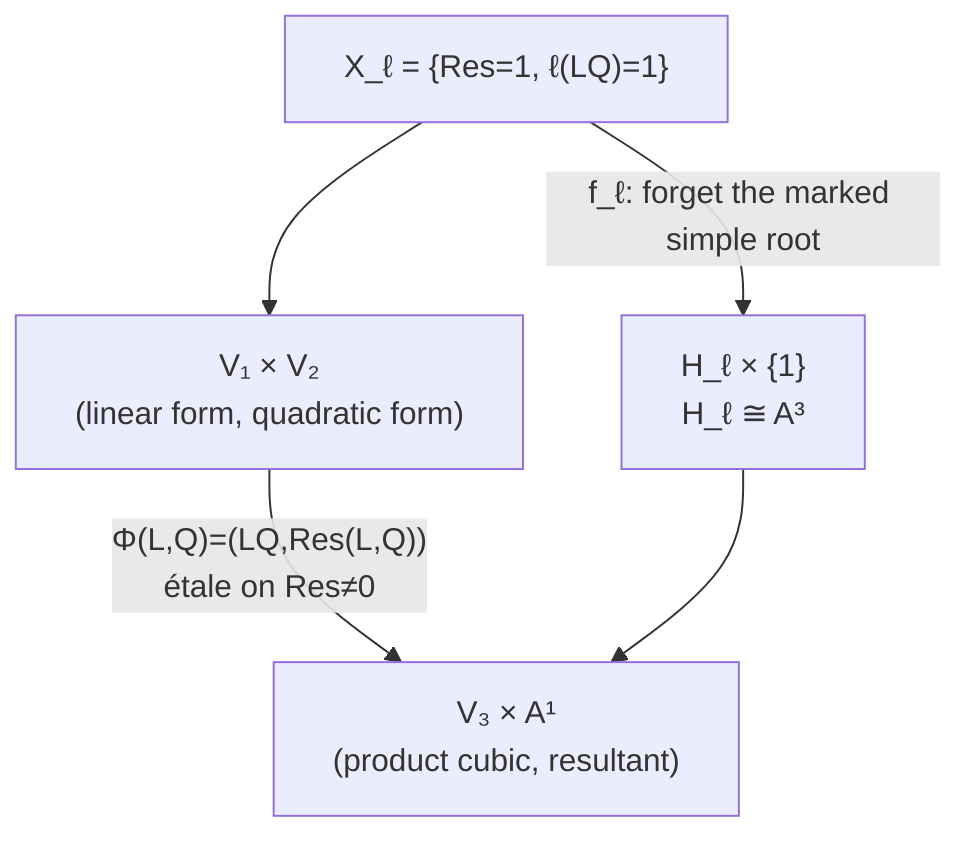
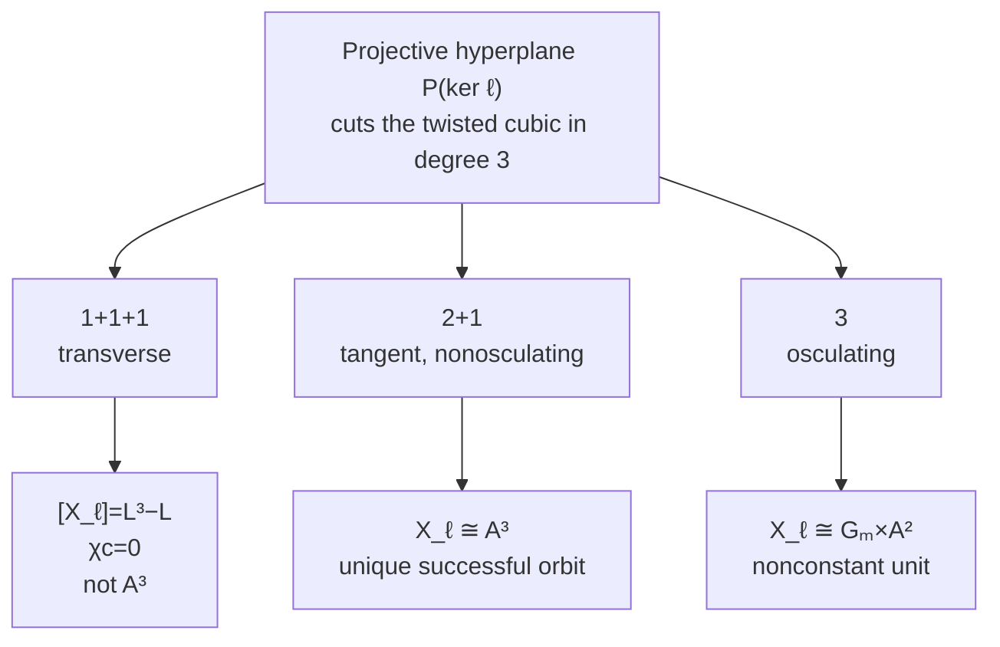
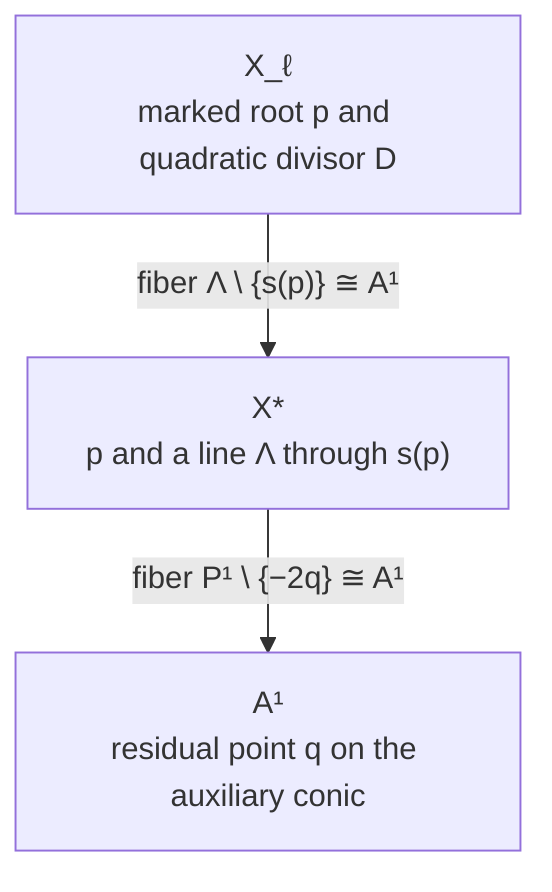
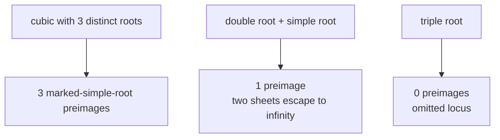

# Diagrams

## 1. Universal coefficient–resultant map and its slices

The lower square is Cartesian. Universal étaleness of \(\Phi\) therefore implies étaleness of every hyperplane slice \(f_\ell\).

## 2. The three hyperplane orbits

## 3. Tangent geometry

The auxiliary conic is
\[
s(p)=\{p,-2p\}\subset\operatorname{Sym}^2(\mathbb P^1)\cong\mathbb P^2.
\]
Both affine-line bundles are trivial because their bases are affine spaces. Hence \(X_\ell\cong\mathbb A^3\).

## 4. Covering behavior

The discriminant is the nonproperness locus. There is no ramification on the source: the map is étale everywhere.
